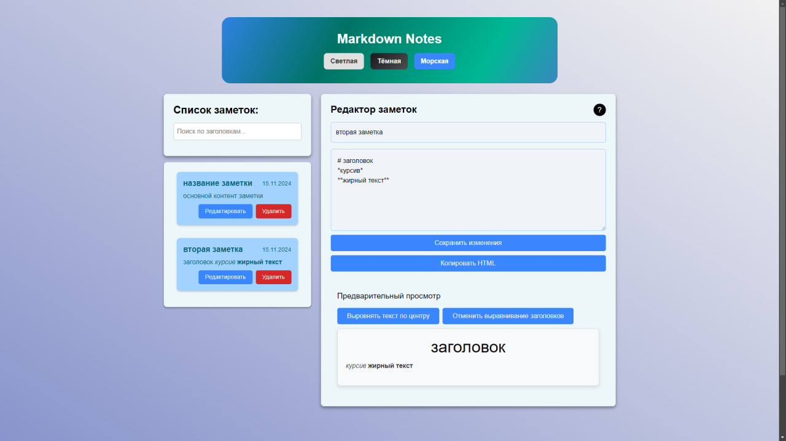
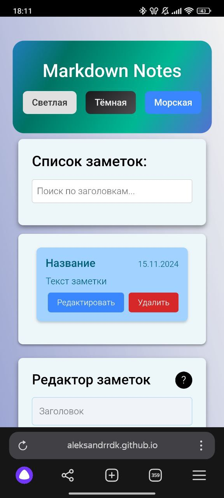

# Markdown Notes

Markdown Notes — это веб-приложение для создания и управления заметками с поддержкой синтаксиса Markdown. Приложение позволяет пользователям записывать заметки, просматривать их в режиме предварительного просмотра, а также копировать форматированный текст в HTML для использования в других приложениях.

## Демо

Приложение доступно онлайн по следующей ссылке:
[Markdown Notes на GitHub Pages](https://aleksandrrdk.github.io/markdown-notes/)

## Функциональные возможности

- Создание, редактирование и удаление заметок.
- Поддержка Markdown для форматирования текста (заголовки, списки, жирный и наклонный шрифт и др.).
- Просмотр заметок в режиме предварительного просмотра Markdown.
- Возможность скопировать HTML-форматированный текст.
- Переключение тем оформления (темная, морская и др.).
- Выравнивание текста и заголовков.
- **Мобильная адаптивность**: приложение корректно отображается на любых устройствах, включая смартфоны и планшеты.
- Хранение заметок и настроек темы локально в браузере.

## Скриншоты

### Десктопная версия



### Мобильная версия



## Установка

Для локального запуска проекта, выполните следующие шаги:

1. **Клонирование репозитория**:

   ```bash
   git clone https://github.com/AleksandrRDK/markdown-notes.git
   ```

2. **Перейдите в директорию проекта**:

   ```bash
   cd markdown-notes
   ```

3. **Установите зависимости**:

   ```bash
   npm install
   ```

4. **Запустите приложение**:
   ```bash
   npm start
   ```

Приложение будет запущено локально на [http://localhost:3000](http://localhost:3000).

## Использование

1. **Создание заметки**: Введите заголовок и содержание заметки с поддержкой синтаксиса Markdown.
2. **Предварительный просмотр**: То, что вы написали в содержании заметки можно будет увидеть в предварительном просмотре ниже.
3. **Выравнивание текста и заголовков**: Используйте кнопки для центрирования текста и заголовков.
4. **Копирование HTML**: После форматирования текста Markdown вы можете скопировать его HTML-представление.

## Технологии

Проект создан с использованием следующих технологий и библиотек:

- **React** — библиотека для создания пользовательских интерфейсов
- **React Markdown** — для рендеринга Markdown-синтаксиса
- **React Transition Group** — для анимации появления и исчезновения заметок
- **Scss** — для стилизации компонентов
- **gh-pages** — для деплоя на GitHub Pages

## Вклад в проект

Если вы хотите внести свой вклад, пожалуйста, следуйте этим шагам:

1. **Сделайте форк репозитория** — скопируйте репозиторий в свой GitHub-аккаунт, нажав на кнопку "Fork" на странице проекта. Это создаст копию проекта в вашем аккаунте, где вы сможете работать независимо.
2. **Создайте ветку для нового функционала** (`git checkout -b feature/new-feature`)
3. **Закоммитьте изменения** (`git commit -m 'Add new feature'`)
4. **Запушьте изменения в удалённую ветку** (`git push origin feature/new-feature`)
5. **Создайте Pull Request** — когда ваш код будет готов, создайте Pull Request (PR), чтобы предложить изменения в оригинальном репозитории.

## Автор

- **AleksandrRDK**
